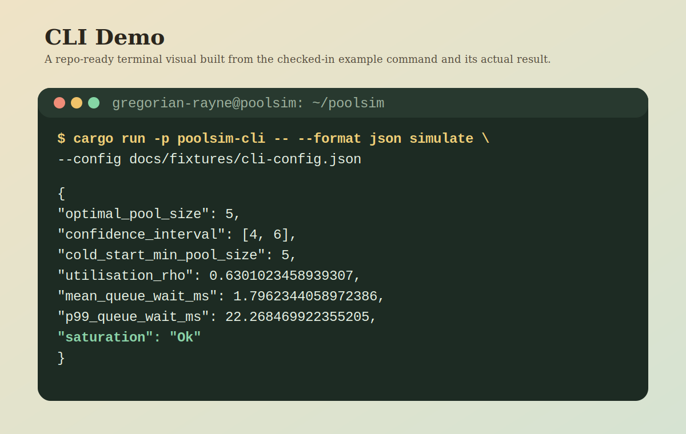
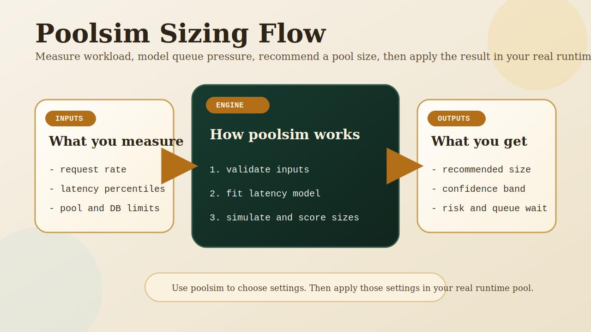

# Poolsim

`poolsim` is a Rust toolkit for connection-pool sizing.

It helps you answer a practical question before production pain starts:

`How large should this pool be for my workload, latency profile, and database limits?`

`poolsim` does not manage live database connections. It models workload behavior, estimates queueing pressure, and recommends safer pool sizes through a library, a CLI, and a web API.



## Why It Exists

Most pool sizes are still chosen by guesswork:

- default framework values
- copied settings from another service
- ad hoc trial and error under pressure

That breaks down when:

- request rate changes
- latency tails get worse
- database connection limits are hard
- you need to justify a sizing decision to a team

`poolsim` gives you a repeatable sizing workflow instead of a guess.

## Why Pool Sizing Is Hard

Pool sizing looks simple until the wrong assumption becomes a production incident.

The hard parts are usually:

- p50 latency looks fine while p99 latency is already dangerous
- database connection limits are fixed, but request rate is not
- one static pool size can be healthy at 180 rps and risky at 260 rps
- saturation appears gradually in average metrics and suddenly in tail latency
- teams often optimize for throughput while ignoring queue wait

That is why `poolsim` focuses on:

- queue pressure, not just raw throughput
- sensitivity across nearby pool sizes, not one magic number
- explicit risk labels, not only numeric output
- repeatable inputs that can be reviewed and rerun

## What It Does

Given workload data, pool bounds, and simulation options, `poolsim` can:

- validate workload and pool inputs
- fit latency distributions from percentile inputs or raw samples
- estimate queueing behavior with Erlang-C style analysis
- run Monte Carlo simulation
- recommend an `optimal_pool_size`
- produce a confidence interval
- classify saturation and risk
- generate sensitivity tables across candidate pool sizes
- evaluate fixed pool sizes
- analyze simple step-load scenarios

Current surfaces:

- `poolsim-core`: sizing and simulation library
- `poolsim-cli`: command-line interface
- `poolsim-web`: REST and WebSocket service



## What It Is Not

`poolsim` is not a runtime pool implementation like HikariCP, `sqlx` pools, `bb8`, or `deadpool`.

Use it to:

- choose pool settings
- compare sizing tradeoffs
- explain headroom and risk

Do not use it to:

- open or borrow live DB connections
- replace your production pool implementation
- auto-enforce runtime settings in the current version

## Quick Start

Run the CLI against the checked-in example config:

```bash
cargo run -p poolsim-cli -- --format json simulate --config docs/fixtures/cli-config.json
```

Start the web service:

```bash
cargo run -p poolsim-web
```

Call the simulation endpoint:

```bash
curl -s \
  -X POST http://127.0.0.1:8080/v1/simulate \
  -H 'content-type: application/json' \
  --data @docs/fixtures/web-simulate.json
```

## Example CLI Output

Real output from the checked-in CLI fixture:

```json
{
  "optimal_pool_size": 5,
  "confidence_interval": [4, 6],
  "cold_start_min_pool_size": 5,
  "utilisation_rho": 0.6301023458939307,
  "mean_queue_wait_ms": 1.7962344058972386,
  "p99_queue_wait_ms": 22.268469922355205,
  "saturation": "Ok"
}
```

That result says:

- size `5` is the current recommendation
- `4..6` is the confidence interval
- the modeled pool is healthy, not saturated
- p99 queue wait is still measurable, so this is not the same as “infinite headroom”

## Main Use Cases

Use `poolsim` when you need to:

- size a new service before rollout
- revisit bad pool defaults
- compare candidate pool sizes against latency targets
- justify pool settings to platform or database teams
- test how close a workload is to saturation
- expose pool sizing as an internal API or service

## Product Surfaces

### `poolsim-core`

Rust library for embedding sizing logic in other Rust applications.

Use it when you want:

- direct API access
- typed request/response models
- custom integration into your own service or tooling

### `poolsim-cli`

Command-line interface for local analysis and automation.

Use it when you want:

- quick experiments from config files
- JSON/CSV/table output
- CI or scripting integration
- batch evaluation from checked-in inputs

### `poolsim-web`

REST and WebSocket service for remote or shared access.

Use it when you want:

- HTTP-based integrations
- browser or dashboard clients
- central sizing endpoints for multiple teams

## `poolsim` vs Runtime Pools

| Tool | Job |
| --- | --- |
| `poolsim` | Recommends and evaluates pool sizes |
| HikariCP / `sqlx` / `bb8` / `deadpool` | Runs real connection pools in production |

Practical model:

1. measure workload and latency
2. run `poolsim`
3. choose settings
4. apply those settings in your actual runtime pool

## Documentation

Start here:

- [docs/README.md](docs/README.md)
- [docs/sizing-calculator.md](docs/sizing-calculator.md)
- [docs/library-api.md](docs/library-api.md)
- [docs/cli-reference.md](docs/cli-reference.md)
- [docs/web-api.md](docs/web-api.md)

Checked-in runnable fixtures:

- [docs/fixtures/README.md](docs/fixtures/README.md)

## Workspace Layout

- `crates/poolsim-core`: library crate
- `crates/poolsim-cli`: CLI crate
- `crates/poolsim-web`: web-service crate
- `docs/`: user-facing documentation only
- `docs/fixtures/`: checked-in runnable example inputs
- `tools/`: maintainer tooling and validation scripts

## Quality Gates

The project currently enforces:

- workspace tests
- public API docs coverage
- checked-in user-doc validation
- executable docs fixtures for library, CLI, and web flows
- full workspace line coverage in CI

## For Maintainers

Canonical version source:

- `VERSION`

Sync version-bearing files after updating `VERSION`:

```bash
python3 tools/sync_version.py
python3 tools/sync_version.py --check
```

Release process:

- [.github/release-checklist.md](.github/release-checklist.md)
- [.github/workflows/publish.yml](.github/workflows/publish.yml)

GitHub Actions publish workflow usage:

1. update `VERSION`, sync metadata, and commit the release changes
2. create and push a tag like `v0.1.0`
3. the `Publish` workflow runs automatically on that tag
4. use `workflow_dispatch` only when you want a manual dry-run or a controlled fallback publish

## Repository

- https://github.com/gregorian-09/poolsim

## Author

- Gregorian Rayne <gregorianrayne09@gmail.com>

## License

- MIT
